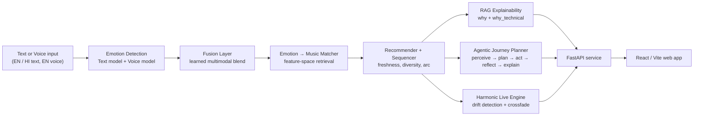

<div align="center">

# 🎧 Aether

### Emotion-Aware Music Intelligence

**Tell Aether how you feel, in your own words, and it composes a playlist built for that exact state.**

[**Live**](https://aether-emotion-music.vercel.app) · [Report a bug](https://github.com/Arnavs10/Aether/issues) · [Request a feature](https://github.com/Arnavs10/Aether/issues)


</div>

---

## What Aether is

Most mood-music tools read your listening history and guess. Aether starts from *you*: you describe your emotional state in free-form English or Hindi, or you speak it in English, and Aether reads the nuance in your words and voice, maps it onto a large catalogue of measured song characteristics, and returns a sequenced playlist that actually fits the feeling. Every recommendation comes with a plain-language reason, and an optional technical breakdown grounded in the song's real audio features.

It recognizes **15 nuanced emotions** rather than a flat happy or sad, understands mixed and shifting moods, and can plan an entire emotional arc for a session rather than a static list.

**Live:** https://aether-emotion-music.vercel.app

---

## Key features

- **Free-form emotional input.** Type how you feel in English or Hindi, or speak it in English. No genre picking, no seed tracks.
- **Multimodal emotion understanding.** A fine-tuned text model and a voice model read the emotion in your words and your tone, then a learned fusion layer combines them into one signal.
- **15-emotion taxonomy.** happy, sad, angry, calm, anxious, energetic, focused, nostalgic, romantic, melancholic, confident, hopeful, frustrated, lonely, dreamy.
- **Explained recommendations.** Each track carries a human-readable `why`, plus a feature-grounded `why_technical` for the curious.
- **Journey mode.** An autonomous agent plans a multi-stage emotional arc for a whole session, not just a single mood snapshot.
- **Harmonic Live mode.** A continuously adapting player that detects emotional drift as you keep talking and transitions between compatible tracks using Camelot-wheel harmonic matching.
- **Fresh delivery.** Recommendations are enriched with current, playable tracks through the iTunes Search API, with one-tap deep links.

---

## How it works

Aether is built as a layered pipeline. Each stage is independently testable, and the whole backend ships with a green test suite.



### The layers, in plain terms

1. **Text emotion.** A fine-tuned DistilRoBERTa reads written input and outputs a distribution over the 15 emotions. It was trained on 80K+ labeled sentences, with several source label spaces mapped into one unified taxonomy.
2. **Voice emotion.** A frozen emotion2vec+ foundation model provides speech embeddings, and a custom MLP head classifies emotion from tone and prosody. Whisper handles speech-to-text. This model reaches 87.2% accuracy and 0.87 weighted F1 on a combined RAVDESS + CREMA-D set.
3. **Fusion.** A learned fuser (trained on MELD) combines the text and voice signals into a single emotional read, and adapts gracefully when only one input is present.
4. **Music matching.** Emotions are matched against a 1.2M-song feature store built from six measured audio characteristics: tempo, energy, valence, danceability, acousticness, and instrumentalness. An intent parser handles English and Hindi requests, supports blended and mixed moods, and enforces artist diversity.
5. **Recommendation and sequencing.** The recommender enriches matches with fresh, playable tracks, sequences them for flow, and exports deep links.
6. **Explainability.** A retrieval-grounded layer produces the plain `why` and the feature-based `why_technical` so recommendations are never a black box.
7. **Agentic Journey planning.** A LangGraph agent runs a perceive, plan, act, reflect, explain loop to design an emotional arc across a whole listening session.
8. **Harmonic transitions.** For continuous Live playback, a drift detector (Jensen-Shannon divergence over the emotional distribution) decides when to move, and a Camelot-wheel matcher picks harmonically compatible transitions with a crossfade planner.

---

## Tech stack

| Layer | Technology |
|-------|-----------|
| ML / Models | Python, PyTorch, HuggingFace Transformers, DistilRoBERTa, emotion2vec+, Whisper, scikit-learn |
| Agentic / RAG | LangChain, LangGraph, grounded retrieval, LLM tool calling |
| Backend | FastAPI, Python |
| Frontend | React 19, Vite, TypeScript, Tailwind CSS, GSAP, Lenis |
| Delivery API | iTunes Search API |
| Deployment | Azure VM (backend), Vercel (frontend) |
| Training | Google Colab (T4 GPU) |

---

## Data and reproducibility

The emotion-matching brain runs on a **1.2M-song feature store** derived from the public *Almost 1 Million Songs* dataset on Kaggle. The store keeps six measured audio features per track.

Following standard practice for machine-learning repositories, the large processed store and the trained model weights are **not committed to Git**. Datasets and weights are build artifacts, not source code, and Git tracks source. Everything needed to regenerate them is in this repo, and the source data is publicly available, so the pipeline is fully reproducible:

```bash
# 1. Download the source dataset from Kaggle (Almost 1 Million Songs)
# 2. Build the feature store locally
python phase_2_music_data/build_store.py
# produces the local .npz feature store used by the matcher
```

Fresh, playable tracks are fetched at request time from the iTunes Search API, so the app stays current without shipping any audio.

---

## Getting started

### Prerequisites

- Python 3.11+
- Node.js 18+
- A Groq API key (free tier is sufficient)

### Backend

```bash
git clone https://github.com/Arnavs10/Aether.git
cd Aether

python -m venv .venv
source .venv/bin/activate          # Windows: .venv\Scripts\activate
pip install -r requirements.txt

# build the feature store (see Data section above)
python phase_2_music_data/build_store.py

# run the API
uvicorn phase_8_website.backend.service:app --reload
```

### Frontend

```bash
cd phase_8_website/frontend
npm install
npm run dev
```

### Environment variables

| Variable | Purpose |
|----------|---------|
| `GROQ_API_KEY` | LLM provider for explanations, chatbot, and Journey planning |
| `AETHER_STORE` | Selects the full feature store vs a sample store |
| `AETHER_LLM_EXPLANATIONS` | `0` routes per-track explanations to grounded templates and preserves the LLM budget for chat and Journey; `1` uses the LLM per track |
| `AETHER_FRESHNESS` | Toggles the iTunes freshness enrichment layer |
| `AETHER_YEAR_MIN` | Minimum release year for fresh-track discovery |

---

## Project structure

```
Aether/
├── phase_1a_text_emotion/      # Fine-tuned DistilRoBERTa (text emotion)
├── phase_1b_voice_emotion/     # emotion2vec+ head + Whisper (voice emotion)
├── phase_1c_fusion/            # Learned multimodal fusion layer
├── phase_2_music_data/         # Feature store builder (1.2M songs, 6 features)
├── phase_3_emotion_music/      # Emotion → music matcher, EN/HI intent parser
├── phase_4_recommendation/     # Recommender, sequencer, freshness, exporter
├── phase_5_rag/                # Grounded explainability (why / why_technical)
├── phase_6_agentic_ai/         # LangGraph Journey planner
├── phase_7_drift_crossfade/    # Camelot matching, drift detection, crossfade
├── phase_8_website/            # FastAPI backend + React/Vite frontend
├── config.py                   # Central config (emotions, paths, constants)
└── requirements.txt
```

---

## Design notes

> <!-- SUBTLE LINE — replace with your exact wording, or keep the line below -->
> The interface follows a clean, understated, premium design language. The web frontend was made with an AI-assisted build workflow; the architecture, backend, machine-learning stack, and product design behind it are my own, built by my own mind.

The visual system is intentionally minimal: a fixed dark palette, a single display typeface, glass surfaces, and hairline detailing, so the focus stays on the music and the emotion behind it.

---

## Roadmap

Aether is fully deployed and functional on desktop. Planned next steps:

- **Full mobile optimization.** The core experience works across devices, and the Live and Connect experiences are being refined for a complete, polished phone build. This is the current top priority.
- **Deeper chatbot knowledge.** The assistant answers current-chart questions well today; support for latest-artist and latest-album/discography lookups will be strengthened in an upcoming update so it is complete across every kind of query.
- **Accounts and profiles.** Google sign-in and saved profiles.
- **Streaming export.** Spotify and Apple Music OAuth for one-tap playlist export.

---

## Known boundaries (by design)

- **Voice input is English-only.** You can type in English or Hindi, and speak in English.
- **Live harmonic transitions use the measured local store.** Fresh iTunes tracks do not expose key or BPM metadata, so precise harmonic matching runs on the store where those values are measured. This is a deliberate accuracy choice, not a gap.
- **Explanation budget is managed.** Per-track explanations can run as grounded templates to preserve the LLM budget for the chatbot and Journey planning.

---

## Acknowledgements

Built on the shoulders of open research and tooling: HuggingFace Transformers, the emotion2vec+ and Whisper model families, RAVDESS and CREMA-D, the MELD dataset, and the public *Almost 1 Million Songs* dataset.

---

## Contact

**Arnav Shukla**
[Portfolio](https://v0-portfolio-website-clone-nu-sage.vercel.app) · [GitHub](https://github.com/Arnavs10) · [LinkedIn](https://www.linkedin.com/in/arnav-shukla10/) · arnavshuklaforbusiness@gmail.com

<div align="center">
<sub>Aether · emotion-aware music intelligence</sub>
</div>
